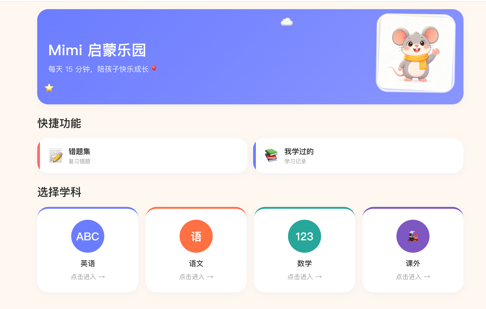

# Mimi 启蒙乐园

> 面向 4–6 岁儿童的开源启蒙学习平台 · 每天 15 分钟，陪孩子快乐成长

支持英语自然拼读、跟读评分、数学练习、语文阅读和学习进度管理。浏览器录音、
TTS 与发音评分开箱即用，游戏化课程地图让孩子主动学完一课又一课。

[在线体验](#在线体验) · [快速开始](#快速开始) · [参与贡献](CONTRIBUTING.md) · [架构文档](docs/architecture.md)


---

## ✨ 核心特性

- 🎙️ **浏览器录音 + 发音评分**：Web Audio API 采集，TTS 合成 + ASR 相似度评分
- 🎮 **游戏化课程地图**：按主题/单元组织，星级奖励与解锁式进度
- 📚 **60 节英语课程**，覆盖 WORD / SENTENCE / PHONICS / DIALOGUE / READING / QUIZ / CALCULATE 七种课型
- 🧠 **错题本 + 已学回顾**：答错自动入册，按掌握度筛选复习，统计累计星星与均分
- 🖼️ **单词配图后端托管**：数据库只存 key，后端下发完整 URL，迁移云存储零改动
- 🚀 **单 JAR 部署**：Vue 构建产物嵌入 Spring Boot 静态资源，一个命令启动整站

> 吉祥物 Mimi（灰老鼠 + 黄围巾）仅在欢迎、学习陪伴、完成庆祝三场景出现，
> 不打扰学习节奏。

---

## 📸 产品截图

> 截图与演示录制路径见 [docs/recording-guide.md](docs/recording-guide.md)。

| 首页 | 课程学习 | 完成庆祝 |
|------|---------|---------|
|  |  |  |

---

## 在线体验

🌐 **官方 Demo**：http://39.96.59.120:8080/app/

部署于阿里云(Alibaba Cloud Linux 3, 2C2G),`main` 分支推送即由
GitHub Actions 自动构建并重启服务,详见 [部署文档](docs/deploy-aliyun.md)。


---

## 快速开始

### 一键启动（Docker）

```bash
docker compose up
```

启动后访问 `http://localhost:8080/app/`。详见 [docker-compose.yml](docker-compose.yml)。

### 云主机部署（裸 JAR + systemd）

小规格云主机(2C2G)推荐直装 JRE 跑 JAR,省去 Docker daemon 内存开销。
`main` 分支推送即由 GitHub Actions 自动部署。完整步骤见
[部署文档](docs/deploy-aliyun.md)。

### 本地开发

环境要求（平台无关）：

- JDK 17+
- Maven 3.8+（或使用 `./mvnw`）
- Node.js 18+ 与 npm
- （可选）百度智能云语音服务密钥

> 必须显式指定 `JAVA_HOME` 指向 Java 17，否则 Maven 会报
> `无效的标记: --release`。各操作系统设置方式见
> [CONTRIBUTING.md](CONTRIBUTING.md#本地开发)。

**后端：**

```bash
cd backend
./run.sh          # 自动加载 .env 并启动
# 或: mvn spring-boot:run
```

后端启动后访问 `http://localhost:8080`。如需语音功能，复制
`backend/.env.example` 为 `.env` 并填入百度密钥；未配置时语音接口返回降级提示，
其余功能正常。

**前端（开发模式）：**

```bash
cd frontend
npm install
npm run dev       # http://localhost:5173,代理 /api 到后端 8080
```

**生产构建（单 JAR）：**

```bash
cd backend && mvn test            # 1. 后端测试
cd ../frontend && npm ci && npm run build   # 2. 构建前端(写入后端 static/app/)
cd ../backend && mvn clean package          # 3. 打包
java -jar target/english-app-backend-*.jar   # 4. 启动,访问 http://localhost:8080/app/
```

> 正式交付不得跳过测试。完整的构建门禁、课程 JSON、Flyway 和配图规范见
> [`docs/project-build-rules.md`](docs/project-build-rules.md)。

### 验证接口

```bash
curl http://localhost:8080/api/v1/subjects
curl http://localhost:8080/api/v1/themes/subject/1
curl http://localhost:8080/api/v1/lessons/22
curl http://localhost:8080/api/v1/progress/learned/stats
curl http://localhost:8080/api/v1/wrong-answers/stats
```

完整 API 文档见 [docs/architecture.md](docs/architecture.md#api-文档)。

---

## 七种课型

| 类型 | 说明 | 交互模式 |
|------|------|----------|
| WORD | 看图认字 | 听发音 → 跟读评分 |
| SENTENCE | 句型朗诵 | 听音 → 跟读评分 |
| READING | 图文阅读 | 翻页阅读 |
| QUIZ | 选择题 | 判对错，答错自动入错题本 |
| CALCULATE | 计算题 | 数字输入判对错 |
| PHONICS | 自然拼读 | 字母发音规则学习 |
| DIALOGUE | 情景对话 | 角色扮演式对话练习 |

---

## 技术栈

| 层级 | 技术 |
|------|------|
| 后端 | Java 17 · Spring Boot 3.2 · JPA · Flyway · SQLite |
| 前端 | Vue 3 · Vite · Pinia · Vue Router |
| 语音 | 百度 TTS + ASR（适配器模式，可切供应商） |
| 部署 | 单 JAR(Vue 构建嵌入 Spring Boot static/) · GitHub Actions 自动部署 |

> Android 版（Kotlin + Jetpack Compose）骨架保留在 `android/`，后续视网页版反馈决定迭代。

详细分层、数据库设计、架构说明见 [docs/architecture.md](docs/architecture.md)。

---

## 参与贡献

欢迎提交 Issue、修复 Bug、补充课程内容或完善文档。

- 🐛 [报告 Bug](https://github.com/pengguogo/english-app/issues/new?assignees=&labels=bug&template=bug_report.md)
- 💡 [功能建议](https://github.com/pengguogo/english-app/issues/new?assignees=&labels=enhancement&template=feature_request.md)
- 🤝 [`good first issue` 入门任务](https://github.com/pengguogo/english-app/labels/good%20first%20issue)

贡献流程与代码约定见 [CONTRIBUTING.md](CONTRIBUTING.md)。

### License

代码遵循 [MIT License](LICENSE)，课程内容与图片素材遵循
CC BY-NC 4.0。涉及第三方品牌（如「汪汪队」）的内容仅作开发示例，
建议公开推广前替换为原创主题。详见 [LICENSE](LICENSE)。
